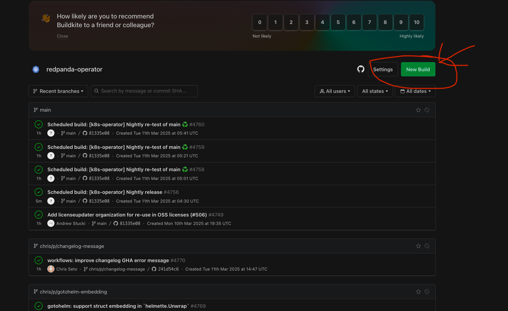
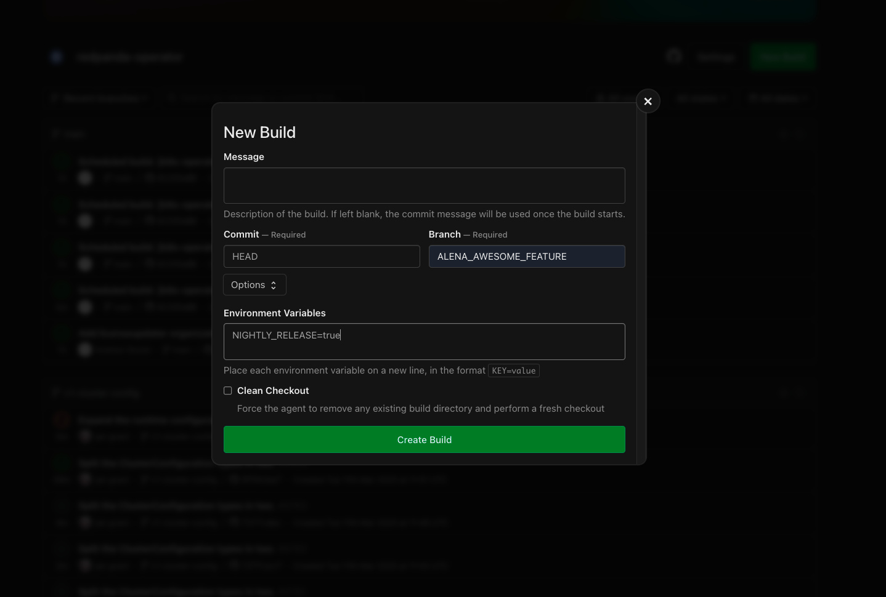

# Contributing

## Development Environment

The development environment is managed by [`nix`](https://nixos.org). If
installing nix is not an option, you can ensure all the tools listed in
[`flake.nix`](./flake.nix) are installed and available in `$PATH`. The exact
versions can been seen in [this test case](./pkg/lint/testdata/tool-versions.txtar).

To install nix, either follow the [official guide](https://nixos.org/download) or [zero-to-nix's quick start](https://zero-to-nix.com/start).

Next, you'll want to enable the experimental features `flakes` and
`nix-command` to avoid typing `--extra-experimental-features nix-command
--extra-experimental-features flakes` all the time.

```bash
# Or open the file in an editor and paste in this line.
# If you're using nix to manage your nix install, you'll have to find your own path :)
echo 'experimental-features = nix-command flakes' >> /etc/nix/nix.conf
```

Now you're ready to go!

```sh
nix develop # Enter a development shell.
nix develop -c fish  # Enter a development shell using fish
nix develop -c zsh  # Enter a development shell using zsh
```

It is recommend to use [direnv](https://direnv.net/) to automatically enter the
development shell when `cd`'ing into the repository. The [.envrc](./.envrc) is
already configured.

### Alternative developer setup

Given Kubernetes cluster to speed up developer lifecycle one could use `task build:image` to
build `localhost/redpanda-operator:dev` container. Then retag operator container as follows
```bash
docker tag localhost/redpanda-operator:dev YOUR_PUBLIC_CONTAINER_REGISTRY/YOUR_CONTAINER_REPO:NEW_UNIQUE_TAG
docker push YOUR_PUBLIC_CONTAINER_REGISTRY/YOUR_CONTAINER_REPO:NEW_UNIQUE_TAG
```
Your Kubernetes cluster needs to be configured with you container registry in order to be able
to pull your fresh container (the easiest would be publicly accessible container registry).
Last step would be to perform the following command
```bash
kubectl set image deployment/OPERATOR_DEPLOYMENT_NAME manager=YOUR_CONTAINER_REGISTRY:YOUR_CONTAINER_TAG 
```

## Backporting

We are currently experimenting with workflows for backporting leveraging the
[backport CLI](https://github.com/sorenlouv/backport). To do a manual backport, once a PR
has merged, ensure that you have a Github personal access token in
`~/.backport/config.json` as documented [here](https://github.com/sorenlouv/backport/blob/v9.6.6/docs/config-file-options.md#global-config-backportconfigjson),
and then run `backport --pr ###` with the PR number.

We will eventually try and set up an automated Github action for backports based on PR labels.

## CHANGELOG Management

Our CHANGELOG.mds are managed with [Changie](https://github.com/miniscruff/changie).
It's configuration is in [`.changie.yaml`](.changie.yaml) and various other files are in [`.changes/`](.changes/).

Whenever a user facing change is made, a change log entry should be added via `changie new`.

The `changie merge` command will regenerate all CHANGELOG.mds and should be run upon every commit.
(This is automatically handled by `task generate`).

### CHANGELOG GHA Check

As it's easy to accidentally forget to add changelog entries, a [GitHub Action](.github/workflows/changelog.yml)
checks that PRs contain a diff to the `.changes/unreleased` directory.

If a PR does not contain any user facing changes, the check can be disabled by
applying the "no-changelog" label.

## Releasing

To release any project in this repository:
1. Mint the version and its CHANGELOG.md entry via `changie batch -j <project> <version>`
2. Run `task test:unit` and `task lint`, they will report additional required actions, if any.
4. Commit the resultant diff with the commit message `<project>: cut release <version>` and rebase it into master via a Pull Request.
5. Tag the above commit with as `<project>/v<version>` with `git tag $(changie latest -j <project>) <commit-sha>`.
    - If the operator is being released, also tag the same commit as `v<version>`.
6. Push the tag(s).

## Nightly build

The step for nightly build is defined in Buildkite 
[pipeline.yaml definition](https://github.com/redpanda-data/redpanda-operator/blob/main/.buildkite/pipeline.yml#L43-L74).

### Scheduled builds

Buildkite has configured periodic jobs that build and pushes operator container with operator
helm chart to https://hub.docker.com/r/redpandadata/redpanda-operator-nightly container repository.
The branches that have configured scheduled build can be found in 
[Branches section in README.md](https://github.com/redpanda-data/redpanda-operator/blob/main/README.md#branches).

### Manual nightly build

In Buildkite anyone with the access to redpanda-operator project can trigger build using 
"New" button upper right corner.

 

As the pop up show up please set specific branch with the `NIGHTLY_RELEASE=true`
environment variable see the following picture 



This will build operator container image and operator helm chart. Those artifacts will be pushed to
https://hub.docker.com/r/redpandadata/redpanda-operator-nightly.
