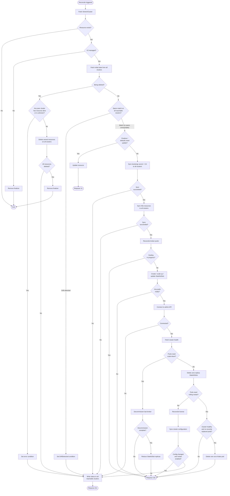

# Multicluster Reconciliation

This document describes the reconciliation loop that manages a Redpanda cluster whose brokers are spread across multiple Kubernetes clusters. It covers each phase of reconciliation in order, explains what decisions the reconciler makes, and identifies the error and edge-case scenarios that can occur at each step.

For background on how the operator elects a leader across clusters and discovers peer clusters, see [multicluster-operator.md](./multicluster-operator.md).

---

## Overview

The reconciler runs on whichever operator instance currently holds cross-cluster leadership. A single reconcile pass walks through a fixed sequence of phases. Each phase either succeeds — allowing the next phase to begin — or signals that reconciliation should stop early. When a phase stops early it records a status condition explaining why, writes that status to every reachable cluster, and schedules a retry.

The phases, in order, are:

1. **Initialization** — gather current state from all clusters.
2. **Deletion handling** — if the resource is being deleted, clean up and exit.
3. **Spec consistency check** — verify that the desired state matches across all clusters.
4. **Finalizer setup** — ensure the resource has a finalizer and default feature flags.
5. **Cross-cluster secret sync** — distribute shared authentication credentials and TLS certificates.
6. **Kubernetes resource sync** — create or update Services, ConfigMaps, RBAC resources, and other supporting objects.
7. **Broker pool management** — create, scale up, or update the StatefulSets that run broker pods.
8. **Admin API initialization** — establish a connection to the Redpanda admin HTTP API.
9. **Decommissioning and rolling restarts** — handle scale-down, remove excess brokers, and roll out-of-date pods.
10. **License and cluster configuration** — apply the enterprise license and synchronize configuration properties.
11. **Status propagation** — write the final status to every reachable cluster.

After a successful pass the reconciler schedules itself to run again in three minutes, ensuring that configuration drift from external sources (rotated secrets, changed licenses) is eventually corrected even without an explicit trigger. If a phase returns an error, the standard Kubernetes controller backoff applies instead.

---

## Phase 1: Initialization

The reconciler begins by collecting the current state of the world:

- It fetches the `StretchCluster` custom resource from the cluster that triggered the reconcile event.
- It fetches all `NodePool` resources from every connected cluster.
- It computes the desired StatefulSets from the spec and compares them with the StatefulSets that already exist.
- It calculates an initial readiness status: are any broker pods ready? Are there no pods at all?
- It collects pod IP addresses for cross-cluster endpoint management (used when the networking mode requires the operator to manage endpoint addresses directly).

If the `StretchCluster` resource does not exist (it was deleted between the event firing and the reconcile starting), the reconciler exits immediately with no error.

**Error scenarios:**
- If a remote cluster is unreachable, it is skipped during initialization — the reconciler treats it as having no existing or desired pools. This means the reconciler can make progress on the clusters it can reach, but it also means it has no visibility into what is running on the unreachable cluster. Pools on that cluster will not be tracked until it reconnects.
- If the local cluster (the one that triggered the reconcile) encounters an error during state collection, the error propagates and the reconciler retries with backoff.

---

## Phase 2: Deletion Handling

If the `StretchCluster` resource has a deletion timestamp, the reconciler enters the deletion path. Deletion has two sequential gates: a safety guard and the actual cleanup. Both must pass before the finalizer is removed.

**Step 1: Guard against partial deletion.** Before cleaning up any resources, the reconciler checks whether the `StretchCluster` still exists (and is not being deleted) on any other cluster. This prevents a situation where deleting the resource on one cluster destroys shared resources — such as Services and StatefulSets — that brokers on the surviving clusters still need.

The guard reads from each cluster's cached Kubernetes client (the informer cache maintained by the cluster manager). For clusters that were previously connected, this succeeds even if the API server is currently unreachable — the guard sees whatever state was last cached.

- If the cached state shows the resource is alive (exists without a deletion timestamp) on any cluster, cleanup is blocked. The reconciler sets an error status condition explaining which cluster still has it, requeues after 10 seconds, and does **not** proceed.
- If a cluster is a configured peer but the operator has not yet established a Kubernetes API connection to it (for example, the peer cluster's operator has not been deployed yet, or its kubeconfig has not been obtained), the guard cannot check it at all and assumes it is alive — cleanup is blocked. This is the safe default: proceeding with deletion while a cluster's state is unknown could destroy data that the cluster still depends on.
- Cleanup proceeds only when every cluster is confirmed to be deleting (the resource has a deletion timestamp) or the resource is already gone (not found).

**Step 2: Clean up resources.** The reconciler issues delete requests for all owned resources (Services, ConfigMaps, StatefulSets, etc.) on every cluster. Unlike the guard — which reads from cache — cleanup makes live API calls to each cluster's API server. If any cluster's API server is unreachable during this step, the delete operations fail and the errors cause the reconciler to retry on the next pass. The finalizer is not removed until cleanup succeeds on every cluster.

**Step 3: Remove the finalizer.** After all resources across all clusters are confirmed deleted, the reconciler removes the finalizer from the `StretchCluster` resource. Kubernetes garbage collection handles the rest.

**Error scenarios:**
- The deletion guard errs on the side of caution. If a peer cluster's operator has not been deployed (or its Kubernetes API connection has not been established), deletion is blocked indefinitely until that cluster becomes reachable or an administrator manually removes the finalizer.
- If a cluster was previously connected but is now unreachable, the guard reads stale cached state. If the resource was marked for deletion before the cache went stale, the guard allows cleanup to proceed — but the actual delete operations in step 2 will fail against the unreachable API server and the reconciler will retry.
- Resource deletion on a remote cluster can fail transiently. The reconciler collects all errors and retries on the next pass.

---

## Phase 3: Spec Consistency Check

Before making any changes, the reconciler verifies that the `.spec` of the `StretchCluster` is identical on every reachable cluster. This is critical because the operator acts on a single spec — if different clusters have different specs, the operator would apply conflicting configurations to different parts of the same Redpanda cluster.

For each peer cluster:
1. The reconciler first checks a cached reachability probe (maintained in the background by the cluster manager) to avoid an API call on every reconcile.
2. If the cluster is reachable, it fetches the `StretchCluster` resource and compares its `.spec` field-by-field with the local copy.

**Outcomes:**
- **All reachable specs match:** Reconciliation continues. If some clusters were unreachable, the status records which clusters could not be checked, but reconciliation is **not** blocked.
- **Drift detected on a reachable cluster:** Reconciliation is blocked on all clusters. The status condition lists which clusters have different specs and which specific fields differ. The reconciler requeues after 10 seconds. An administrator must update the specs to match before reconciliation resumes.

**Error scenarios:**
- Unreachable clusters do not block reconciliation — only detected drift on a reachable cluster does. This means a cluster that is down and later comes back with a different spec will be caught on the next reconcile after it reconnects.
- If the API call to fetch a remote `StretchCluster` fails for reasons other than the cluster being unreachable (e.g. RBAC misconfiguration), the cluster is treated as unreachable and skipped.

---

## Phase 4: Finalizer Setup

The reconciler ensures the `StretchCluster` has a finalizer (so that deletion goes through the cleanup path in Phase 2) and that default feature flag annotations are set.

If either the finalizer or annotations were changed, the reconciler persists the update and immediately requeues after 1 second. This short requeue prevents stale-cache issues — the reconciler wants to see its own update reflected before proceeding.

**Error scenarios:**
- A conflict error (another writer updated the resource concurrently) is handled gracefully and does not propagate as a reconciler error.

---

## Phase 5: Cross-Cluster Secret Sync

Two categories of secrets must exist identically on every cluster before brokers can start: authentication credentials and TLS certificate authorities. These are handled by two independent syncers that run in sequence.

### Bootstrap Authentication Secret

When authentication is enabled, the operator manages a shared credential that brokers and the operator itself use to authenticate with the Redpanda admin API. This secret must contain the same password on every cluster.

The sync process has four steps:

1. **Scan:** Read the bootstrap secret from every cluster. If multiple clusters already have the secret, verify they all contain the same password.
2. **Detect conflicts:** If two clusters have different passwords, the reconciler sets a `PasswordMismatch` status condition and returns an error. This requires manual intervention — an administrator must delete the incorrect secret(s) and let the reconciler recreate them.
3. **Generate or reuse:** If no secret exists anywhere, generate a new random 32-character password. If a secret already exists on at least one cluster, reuse that password.
4. **Distribute:** Create the secret on every cluster that does not already have it. The secret is marked as immutable (Kubernetes will reject any modification) and owned by the local `StretchCluster` resource on each cluster.

Unreachable clusters are skipped during distribution — they will receive the secret on a future reconcile when they become reachable.

**Error scenarios:**
- Password mismatch across clusters is a blocking error that requires human intervention.
- The scan phase reads from each cluster's cached Kubernetes client. For a cluster that the operator has previously connected to, the read succeeds from cache even if the API server is currently unreachable — the scan will see whatever secret state was last cached. If a peer cluster's API connection has not been established yet (e.g. its operator has not been deployed), the scan returns an error and the entire sync aborts. If the secret read itself fails for any other reason (e.g. not found), the cluster is silently skipped.
- During distribution (step 4), unreachable clusters are explicitly checked via a reachability probe and skipped gracefully.

### TLS Certificate Authority

When TLS is enabled (which it is by default), the operator generates a root CA for each managed certificate and distributes it to all clusters. Leaf certificates are then derived from this CA.

The sync follows the same scan-generate-distribute pattern as the bootstrap secret, with one important difference: **CA secrets are never overwritten.** If a CA secret already exists on a cluster, the reconciler leaves it in place. Overwriting a CA would invalidate all leaf certificates signed by the old CA, breaking TLS for every broker.

**Error scenarios:**
- CA generation failure (e.g. cryptographic library error) is returned as an error and retried.
- The scan phase behaves the same as the bootstrap secret scan: it reads from each cluster's cached client, succeeding from cache for previously-connected clusters even if they are currently unreachable. It only errors if a peer cluster's API connection has not been established yet. During distribution, unreachable clusters are explicitly checked and skipped.

---

## Phase 6: Kubernetes Resource Sync

The reconciler computes the full set of Kubernetes resources that should exist for the `StretchCluster` — Services, ConfigMaps, Secrets (beyond the ones from Phase 5), RBAC roles and bindings, PodDisruptionBudgets, Endpoints, EndpointSlices, monitoring resources, and networking resources (ServiceExports/ServiceImports for multi-cluster service discovery).

It then applies these resources to every cluster using server-side apply. Resources that should no longer exist (because the spec changed) are garbage-collected by label: every resource the operator creates carries ownership labels, and any labeled resource that is no longer in the desired set is deleted.

For remote clusters, unreachable errors are logged but do not fail the reconcile — the operator continues applying resources on the clusters it can reach. For the local cluster (the one that triggered the reconcile), errors propagate and cause a retry.

**Error scenarios:**
- A terminal error (e.g. invalid resource spec rejected by the API server with a 4xx status) sets a `TerminalError` status condition. The reconciler does not retry terminal errors — they require a spec change to resolve.
- A transient error (e.g. network timeout) sets an `Error` status condition and triggers a retry with backoff.
- If a resource apply hits a conflict (another writer modified the resource concurrently), the conflict is ignored and the reconciler moves on.

---

## Phase 7: Broker Pool Management

This phase manages the StatefulSets that run broker pods. It handles three operations in sequence: creation, scale-up, and spec updates.

### Readiness gate

Before making any scaling changes, the reconciler checks whether a previous scaling operation is still in progress. A scaling operation is in progress if any StatefulSet's reported replica count does not match its desired replica count, or if the number of running pods does not match. If scaling is in progress, the reconciler requeues after 10 seconds without making changes.

### Creation

StatefulSets that do not yet exist are created. This happens when a new pool is added to the spec.

### Scale-up

StatefulSets that exist but have fewer replicas than desired are patched to increase their replica count. Kubernetes then creates the new pods.

### Spec updates

StatefulSets whose spec has changed (detected by comparing generation and configuration version labels) are patched with the new spec. This does not trigger a rolling restart on its own — Kubernetes StatefulSet updates with the `OnDelete` strategy wait for the operator to explicitly delete pods, which happens in Phase 9.

After applying changes, the reconciler checks whether any pods are ready. If no pods are ready (and the desired count is non-zero), it requeues after 10 seconds to wait for pods to come up before proceeding to the admin API phases.

**Error scenarios:**
- StatefulSet creation or patching failures on remote clusters are logged and skipped; failures on the local cluster propagate as errors.
- If the readiness gate detects an in-progress operation, reconciliation pauses at this phase. This prevents the operator from making overlapping scaling changes.

---

## Phase 8: Admin API Initialization

If there are broker pods running, the reconciler establishes a connection to the Redpanda admin HTTP API. This connection is used by the remaining phases for operations that cannot be performed through Kubernetes alone — decommissioning brokers, applying configuration, and checking licenses.

If no broker pods exist (the cluster is being scaled to zero or has not started yet), this phase is a no-op and subsequent admin API phases are skipped.

**Error scenarios:**
- If the admin API connection fails (wrong credentials, TLS mismatch, all brokers unreachable), the error propagates and the reconciler retries. Phases 9 and 10 cannot proceed without this connection.

---

## Phase 9: Decommissioning and Rolling Restarts

This is the most complex phase. It handles three related concerns: scale-down, StatefulSet deletion, and rolling restarts of out-of-date pods.

### Health check

The phase begins by fetching the Redpanda cluster's health overview from the admin API. This health status determines whether it is safe to take disruptive actions.

### Scale-down (decommissioning)

When a pool's desired replica count is lower than its current count, the reconciler must remove brokers. Brokers cannot simply be terminated — they hold partition replicas that must be moved to other brokers first. This process is called decommissioning.

Scale-down proceeds one broker at a time:

1. **Identify the broker.** The reconciler maps the last pod in the StatefulSet (the one with the highest ordinal) to its Redpanda broker ID by querying the admin API for all known brokers and matching by pod name or IP.
2. **Initiate decommissioning.** If the broker is not already decommissioning, the reconciler tells Redpanda to begin moving its partition replicas to other brokers.
3. **Wait for completion.** On each reconcile pass, the reconciler checks the decommission status. If it is still in progress, it requeues after 10 seconds.
4. **Reduce the StatefulSet.** Once decommissioning is complete (all partition replicas have been moved), the reconciler patches the StatefulSet to reduce its replica count by one. Kubernetes then terminates the pod.
5. **Repeat.** Because only one broker is decommissioned per reconcile pass, further scale-down happens on the next pass.

If the broker has already been fully removed from the cluster (it does not appear in the broker list), the reconciler skips decommissioning and directly reduces the StatefulSet.

### StatefulSet deletion

Pools that should no longer exist (removed from the spec entirely) are deleted, but only after their replica count has been reduced to zero through the scale-down process above. The reconciler verifies that both the desired and reported replica counts are zero before deleting the StatefulSet, preventing premature deletion while pods are still terminating.

### Rolling restarts

After all scaling operations are complete, the reconciler checks for pods that are running an outdated revision (their revision label does not match the StatefulSet's current revision). These pods need to be restarted to pick up the new spec.

Rolling restarts follow these rules:

- **Recently replaced pods block further rolling.** If a pod was recently replaced (it has the latest revision but is not yet fully ready, or it is still terminating), the reconciler waits before rolling any more pods. This prevents two pods from being unavailable simultaneously.
- **Pods not known to Redpanda are always safe to roll.** If a pod does not appear in the broker map (Redpanda does not know about it), it can be deleted without risk — it has no partition replicas.
- **Pods known to Redpanda require a healthy cluster.** If the cluster is healthy (all brokers are up and all partitions have sufficient replicas), one pod is deleted and the reconciler requeues to let the replacement come up before rolling the next one.
- **Unhealthy cluster blocks rolling.** If the cluster is not healthy, the reconciler skips the pod and checks whether any other pod can be rolled. If no pod can be rolled, it requeues and waits for health to recover.

**Error scenarios:**
- Decommissioning can take a long time if there are many partition replicas to move. The reconciler does not time out — it checks progress every 10 seconds indefinitely.
- If a broker's decommission status check fails (admin API error), the error propagates and the reconciler retries.
- If the cluster is unhealthy and there are pods to roll, reconciliation is stuck at this phase until health recovers. The status reflects this via the `Healthy` condition.
- If a pod delete (for rolling restart) fails, the error propagates and the reconciler retries.

---

## Phase 10: License and Cluster Configuration

These two operations use the admin HTTP API to manage Redpanda-level settings.

### License

If the spec includes an enterprise license (either inline or as a reference to a Kubernetes Secret), the reconciler applies it to the Redpanda cluster via the admin API. It then checks the license status and records it in the `StretchCluster` status.

License reconciliation is rate-limited: if the license was successfully applied within the last minute, the reconciler skips the API call and carries forward the existing status. This avoids unnecessary admin API calls on every 10-second requeue.

When the license is specified as a Secret reference, the reconciler searches all connected clusters for the Secret. This allows the license to be stored on any cluster, not necessarily the one running the leader operator.

**Error scenarios:**
- If the license Secret is not found on any cluster, the reconciler returns an error.
- If the admin API rejects the license (e.g. malformed), the error propagates.

### Cluster configuration

The reconciler synchronizes Redpanda cluster configuration properties (e.g. retention policies, authentication settings) from the `StretchCluster` spec to the running cluster via the admin API. It also manages the superuser list, combining:
- Users from a referenced Kubernetes Secret (if configured).
- The bootstrap authentication user created in Phase 5.

Like the license, configuration sync is rate-limited to once per minute when the configuration is already applied and unchanged.

If a configuration change affects properties that require a broker restart, the reconciler records a new configuration version. On the next reconcile pass, this version change triggers the rolling restart logic in Phase 9 — pods whose configuration version label does not match the new version are rolled one at a time.

**Error scenarios:**
- Admin API errors during configuration sync propagate and trigger a retry.
- If the superuser Secret cannot be read, the error propagates.

---

## Phase 11: Status Propagation

At the end of every reconcile pass — whether it completed all phases or stopped early — the reconciler writes the accumulated status back to the `StretchCluster` resource. Because the resource exists on every cluster, the status is written to all reachable clusters so that users can inspect it from any cluster.

For each cluster:
1. The reconciler checks reachability (using the cached probe).
2. If reachable, it fetches the latest version of the `StretchCluster` to get the current resource version (required by Kubernetes to prevent stale writes).
3. It overwrites the `.status` field and calls the status update API.

Unreachable clusters are skipped. Their status will be updated on a future reconcile when they become reachable.

If the status has not changed since the last write, the update is skipped entirely.

**Error scenarios:**
- A conflict error on status update (another writer changed the resource version) is handled gracefully — the reconciler does not treat it as a failure.
- Status update failures on multiple clusters are joined into a single error. If any status update fails, the reconciler retries.

---

## Status Conditions Reference

The `StretchCluster` status contains a set of conditions that together describe the health of the reconciliation process. Each condition is a standard Kubernetes condition with a type, status (True/False/Unknown), reason, and optional message.

| Condition | Set By | Description |
|-----------|--------|-------------|
| `Ready` | Initialization | Whether any broker pods are ready to serve traffic. |
| `Healthy` | Decommission phase | Whether the Redpanda cluster reports itself as healthy via the admin API. |
| `ResourcesSynced` | Resource sync / Pool management | Whether all Kubernetes resources (Services, ConfigMaps, StatefulSets, etc.) are in the desired state. |
| `SpecSynced` | Spec consistency check | Whether the `.spec` is identical across all reachable clusters. |
| `BootstrapUserSynced` | Bootstrap secret sync | Whether the authentication credential secret has been distributed to all clusters. |
| `ConfigurationApplied` | Configuration sync | Whether Redpanda cluster configuration properties match the spec. |
| `LicenseValid` | License sync | Whether the enterprise license is present and valid. |

Each condition can have a `TerminalError` reason, which indicates a non-retryable failure that requires a spec change or manual intervention. Non-terminal errors are retried automatically.

---

## Requeue Intervals

| Interval | Duration | Used When |
|----------|----------|-----------|
| Periodic requeue | 3 minutes | After a fully successful reconcile, to catch external drift. |
| Operational wait | 10 seconds | When a scaling operation, decommission, rolling restart, or spec drift blocks progress. |
| Finalizer requeue | 1 second | After updating the finalizer or annotations, to avoid stale-cache issues. |
| Error backoff | Exponential (controller-runtime default) | After any phase returns an error. |

---

## Situations Requiring Intervention

Most errors the reconciler encounters are transient and resolve on their own through retries. The scenarios below are different — they represent states where the reconciler is stuck and will not make progress until an administrator acts.

### Spec drift across clusters

- **Symptom:** Reconciliation is blocked. No resources are created, updated, or deleted.
- **Condition:** `SpecSynced` = False, reason `DriftDetected`. The message lists which clusters differ and which fields.
- **Cause:** The `StretchCluster` `.spec` was modified on one cluster without updating the others.
- **Recovery:** Update the spec on all clusters so they are identical. Reconciliation resumes automatically once the specs match.

### Deletion stuck

- **Symptom:** The `StretchCluster` was deleted but the finalizer is not removed. The resource continues to exist with a `deletionTimestamp` and is never fully removed.
- **Condition:** `ResourcesSynced` = False. The message may name a specific cluster.

The deletion guard blocks cleanup whenever it cannot confirm that every cluster is also deleting the resource. There are two common causes:

1. **Resource deleted on one cluster but not the others.** The guard sees the resource still alive on a peer cluster and blocks to prevent destroying resources that the peer's brokers still need. **Recovery:** Delete the `StretchCluster` from all clusters. If the deletion was accidental, remove the finalizer from the cluster where it was mistakenly deleted (`kubectl patch stretchcluster <name> -p '{"metadata":{"finalizers":null}}' --type=merge`) and re-apply the resource.

2. **A peer cluster's API connection has not been established.** The operator knows the peer exists (it is a configured member of the raft group) but has never connected to its Kubernetes API — for example, the peer's operator has not been deployed yet. The guard cannot check whether the resource exists there, so it assumes it is alive and blocks. **Recovery:** Deploy the peer cluster's operator so the connection can be established, or manually remove the finalizer.

### Bootstrap user password mismatch

- **Symptom:** Reconciliation is blocked at the secret sync phase. Brokers may not start or may fail authentication.
- **Condition:** `BootstrapUserSynced` = False, reason `PasswordMismatch`. The message names the clusters with conflicting secrets.
- **Cause:** The bootstrap user secret was created independently on multiple clusters with different passwords. This can happen if an administrator manually created or modified the secret.
- **Recovery:** Delete the incorrect secret(s) on the clusters named in the condition message. The reconciler will recreate them with a consistent password on the next pass.

### Terminal error on resource sync

- **Symptom:** Reconciliation completes but resources are not in the desired state.
- **Condition:** `ResourcesSynced` = False, reason `TerminalError`. The message contains the API server rejection.
- **Cause:** The spec produces a Kubernetes resource that the API server rejects — for example, an invalid field value, a resource that violates an admission webhook, or a resource type that does not exist in the cluster.
- **Recovery:** Fix the `StretchCluster` spec to produce valid resources. The reconciler does not retry terminal errors automatically.

### Invalid cluster configuration

- **Symptom:** Kubernetes resources and broker pods are healthy, but the cluster configuration is not applied. The reconciler retries with exponential backoff.
- **Condition:** `ConfigurationApplied` = False, reason `TerminalError`. The message contains the Redpanda admin API rejection (typically a 400 Bad Request with details about which property is invalid).
- **Cause:** The `StretchCluster` spec contains cluster configuration properties that Redpanda rejects — for example, a property value outside the allowed range, conflicting properties that cannot both be set, or a property name that does not exist on this Redpanda version.
- **Recovery:** Fix the cluster configuration in the `StretchCluster` spec. The admin API error message identifies which property was rejected and why. Once the spec is corrected, the reconciler applies the configuration on the next pass.

### Missing referenced Secrets or ConfigMaps

- **Symptom:** Reconciliation fails repeatedly at the license or configuration phase. The reconciler retries with exponential backoff but never succeeds.
- **Condition:** `LicenseValid` = False (reason `Error`) if the license Secret is missing. `ConfigurationApplied` = False (reason `Error`) if a Secret or ConfigMap referenced by cluster configuration environment variables is missing.
- **Cause:** The spec references a Kubernetes Secret or ConfigMap that does not exist — for example, a license Secret that was never created, a SASL user Secret that was deleted, or a ConfigMap used for environment variable substitution in cluster configuration.
- **Recovery:** Create the missing Secret or ConfigMap in the correct namespace, or update the spec to remove or correct the reference. The reconciler will pick up the resource on the next pass.

### Unhealthy cluster blocking rolling restarts

- **Symptom:** Pods are running an outdated spec but are not being restarted. The reconciler requeues every 10 seconds without making progress.
- **Condition:** `Healthy` = False, reason `NotHealthy`.
- **Cause:** The Redpanda cluster reports itself as unhealthy (under-replicated partitions, unreachable brokers, etc.). The reconciler refuses to restart additional pods while the cluster is in this state to avoid making things worse.
- **Recovery:** Investigate and resolve the cluster health issue. Common causes include: a broker that crashed and is not restarting, persistent storage failures, or network partitions between brokers. Once the cluster reports healthy, rolling restarts resume automatically.

### Pods not becoming ready

- **Symptom:** Reconciliation is stuck at the pool management phase, requeuing every 10 seconds. The admin API phases (decommissioning, license, configuration) never run.
- **Condition:** `Ready` = False, reason `NotReady`.
- **Cause:** Broker pods cannot start or pass their readiness checks. Common causes include: image pull errors, insufficient CPU or memory resources, PersistentVolumeClaim binding failures, or misconfigured liveness/readiness probes.
- **Recovery:** Inspect the pod events and logs (`kubectl describe pod`, `kubectl logs`) to identify why the pods are not ready. Fix the underlying issue (e.g. correct the image reference, increase resource quotas, provision storage). The reconciler will detect readiness and proceed automatically.

### Admin API unreachable

- **Symptom:** Kubernetes resources (StatefulSets, Services, ConfigMaps) are created and up to date, and broker pods are running, but license, configuration, decommissioning, and rolling restart operations never execute. The reconciler retries with exponential backoff.
- **Condition:** No specific condition signals this directly. `ResourcesSynced` may be True (Kubernetes resources are fine), but `Healthy`, `ConfigurationApplied`, and `LicenseValid` remain stale or Unknown because the phases that set them never run.
- **Cause:** The operator cannot establish a connection to the Redpanda admin HTTP API. Common causes include: TLS certificates were manually rotated or modified without updating the corresponding Kubernetes Secrets, the bootstrap user secret was deleted or modified (breaking authentication), or a network policy is blocking the operator from reaching the admin API port.
- **Recovery:** Check the operator logs for the specific connection error. If TLS-related: verify that the TLS Secrets referenced by the `StretchCluster` contain valid certificates and that the CA matches what the brokers are using. If authentication-related: verify that the bootstrap user secret exists on the leader's cluster and that its password matches what the brokers expect. If the bootstrap user secret was corrupted, delete it on all clusters and let the reconciler regenerate it (Phase 5). If a network policy is the cause, update it to allow the operator pod to reach the admin API service.

### Decommission never completing

- **Symptom:** A scale-down operation is in progress but the broker count does not decrease. The reconciler requeues every 10 seconds indefinitely.
- **Condition:** `Healthy` may be True (the cluster is healthy but the decommission is not finishing).
- **Cause:** Redpanda cannot finish moving partition replicas off the broker being decommissioned. This can happen if there are not enough remaining brokers to satisfy the replication factor, or if other brokers do not have sufficient disk space.
- **Recovery:** Check the decommission status via the Redpanda admin API (`rpk cluster partitions` or the admin API's decommission status endpoint). Either add capacity (more brokers or more disk space) so the partition moves can complete, or cancel the scale-down by restoring the original replica count in the spec.

---

## Reconciliation Flow

